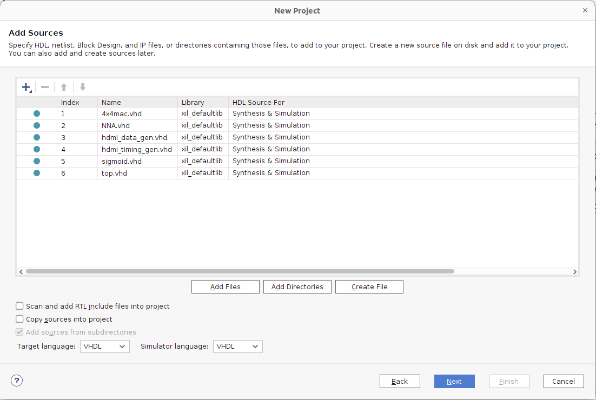
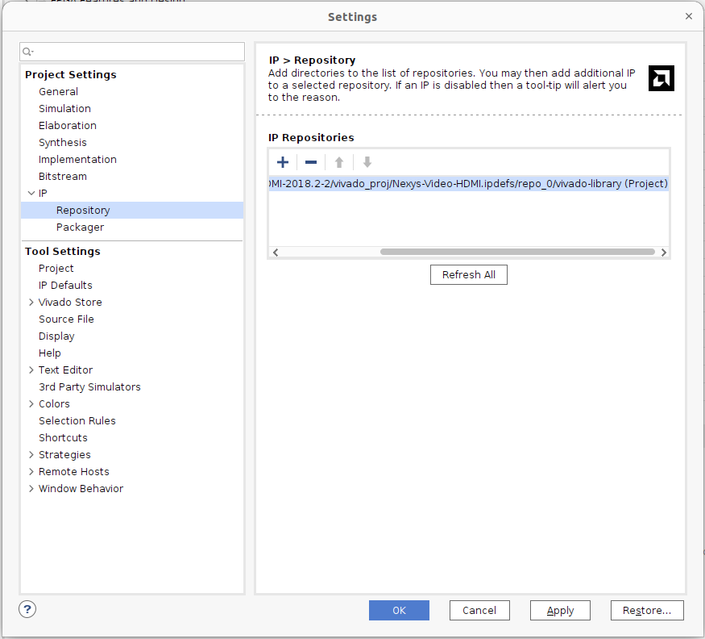
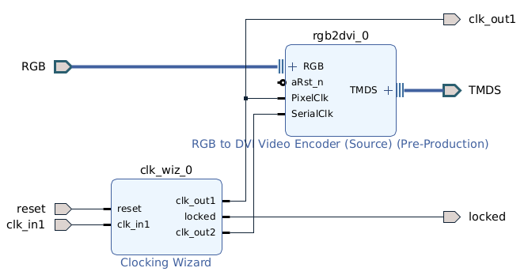
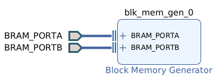

# Neural Network-Based Game Simulator on FPGA
## Description
- This project implements a neural network–based game simulator on an FPGA, which uses a neural network to predict future game frames based on past predictions and player inputs from FPGA buttons while simultaneously outputting the frames to a display via HDMI.
- In this implementation, a neural network is trained on the Pong game. Once trained, the model's weights and layer configurations are converted into rows of hexadecimal values, which are used to initialize the FPGA's Block RAM during bitstream generation.
- While the FPGA is running, the Neural Network Accelerator implemented on the FPGA reads layer information, weights, and input feature maps from Block RAM, computes the output feature map, and writes it back to Block RAM. Simultaneously, the HDMI module reads the predicted frame from Block RAM and outputs it to the display via the FPGA’s HDMI port.
- With a fixed neural network architecture, the game simulated on the FPGA can be changed simply by updating the layer information and weights initialized in Block RAM, enabling a seamless, hardware-integrated, machine learning–driven game simulation.


## Requirements
- Nexys Video
- Vivado Installation with Xilinx SDK
- HDMI Cable
- HDMI capable Monitor/Display

## Demo Setup
- Create a new Vivado project and set the target language to VHDL. Then, add all the vhdl files from the ```VHDL``` folder as source files to the project.

- On the following page, add the constraint file located in the ```VHDL``` folder. Then, in the subsequent steps, select the Nexys Video board as the target hardware. Complete the remaining steps to finish creating the project.
- Download the HDMI example provided by Digilent in the following repository: ```https://github.com/Digilent/Nexys-Video-HDMI#```. Then, add the ```rgb2dvi``` IP core from this repository to your Vivado project.

- Create a Block Design in Vivado and name it ```hdmi_rgb2dvi```. Add and configure a ```Clocking Wizard``` block with ```clk_out1``` set to 25.2 MHz and ```clk_out2``` set to 126 MHz. Then, add the ```rgb2dvi``` IP block to the design. After completing the configuration, click ```Generate Output Products``` to generate the necessary files.

- Create another Block Design in Vivado and name it bram. Add a Block Memory Generator IP block and configure it with the following specifications:
    - Set the memory type to Stand-Alone with True Dual Port RAM
    - Configure the memory width to 256 bits and depth to 52,224
    - Use the initial_hex_bram.coe file located in the Python folder for memory initialization

    After completing the configuration, click ```Generate Output Products``` to generate the necessary files.
    

- After completing the design, generate the bitstream. Once the bitstream has been successfully generated, program it to the device.


